## Ch2 基本概念

### 2.1 环境

#### 2.1.1 翻译环境

- 翻译过程：各源文件通过`编译过程`分别转为**目标代码** -> 各目标代码文件由**链接器**捆绑为单一完整的可执行程序

- 编译过程：预处理器处理 -> 源代码经过**解析**判断语句的意思，从而生成目标代码 -> 优化器对目标代码进一步处理

#### 2.1.4 执行环境

- 程序执行过程：程序载入内存 -> 启动程序调用main函数 -> 程序的终止

- 程序运行过程中使用一个运行时的**堆栈**，用于存储函数的局部变量和返回地址；同时，程序也可以使用**静态内存**，其中的值在程序整个执行过程都会保留

### 2.2 词法规则

#### 2.2.1 字符

- \ddd：三个八进制数字表示的字符

- \xddd：三个十六进制数字表示的字符

#### 2.2.2 注释

- //：单行注释

- /*     */：多行注释

### TIPS:

- 有的程序从标准输入读取数据，读到EOF停止，在终端输入时Ctrl+D即为输入EOF

## Ch3 数据

### 3.1 基本数据类型

#### 3.1.1 整型

变量的最小范围

| 类型               | 最小范围             |
| ------------------ | -------------------- |
| char               | 0 ~ 2^7^-1           |
| signed char        | -(2^7^-1) ~ 2^7^-1   |
| unsigned char      | 0 ~ 2^8^-1           |
| short int          | -(2^15^-1) ~ 2^15^-1 |
| unsigned short int | 0 ~ 2^16^-1          |
| int                | -(2^15^-1) ~ 2^15^-1 |
| unsigned int       | 0 ~ 2^16^-1          |
| long int           | -(2^31^-1) ~ 2^31^-1 |
| unsigned long int  | 0 ~ 2^32^-1          |

- short int至少16位，long int至少32位

- 头文件limits.h说明各种不同的整型的特点

**一、整型常量**

- 声明为const，初始化之后不能被改变

- 十进制整型常量可能是int、long、unsigned long。缺省情况下为最短类型但能完整容纳这个值

- 八进制整数以0开头

- 十六进制整数以0x开头

- 字符常量：类型为int，是单引号包围的单个字符

  ```c
  'M'			'\n'
  ```

- 宽字符常量：多字节字符常量的前面有个L

  ```c
  L'X'		L'e^'
  ```

**二、枚举类型**

```c
// 声明类型
enum Jar_Type {CUP, PINT, QUART, HALF_GALLON, GALLON};

// 定义变量
enum Jar_Type milk_jug, gas_can, medicine_bottle;
```

- 以整型方式存储，符号名实际值都是整型值。如CUP=0，PINT=1，以此类推
- 可以显式定值，若未指定值，则比前一个符号名大1

#### 3.1.2 浮点类型

- 包括float、double、long double类型
- 所有浮点类型至少能容纳从10^-37^到10^37^之间的任何值
- 头文件float.h说明各种不同的浮点型的特点
- 浮点数默认为double类型；后面跟L/l表示long double；后面跟F/f表示float

#### 3.1.3 指针

**一、指针常量**

- 一般都通过操作符来获得一个变量的地址，而不是通过表示为字面值的指针常量，如0xff2044ec

**二、字符串常量**

- 字符串：以NUL字节结尾的零个或多个字符，存储在字符数组中
- 字符串常量：直接值是一个“指向字符的指针”，而不是这些字符本身

### 3.2 基本声明

#### 3.2.2 声明简单数组

```c
int value[20];
```

- 编译器不检查数组的下标是否在合法范围内，所以当下标是通过用户输入计算而来的，必须检测是否越界
  - 如果越界，不会报错，只会返回null

#### 3.2.3 声明指针

```c
int *a;

char *message = "Hello World";
// 把message声明为一个指向字符的指针，并用字符串常量中的第1个字符的地址对其初始化
// 等价于以下语句
char *message;
message = "Hello World";
```

### 3.3 typedef

为各种数据类型定义新名字

```c
// 将变量ptr_to_char声明为一个指向字符的指针类型的新名字
typedef char *ptr_to_char;

// 声明a是一个指向字符的指针
ptr_to_char a;
```

### 3.4 常量

const

```c
// 声明整数常量
const int a;
int const a;

// 声明一个指向整型常量的指针
int const *pci;

// 声明一个指向整型的常量指针
int * const cpi;
```

#define

```c
#define MAX_LEN 20
```

### 3.5 作用域

#### 3.5.1 代码块作用域

- 代码块：位于一对花括号之间的所有语句

- 嵌套代码块中，内层可以访问外层变量，而外层无法访问内层变量，但是当内外层有名字相同的变量时，内层无法访问外层的那个同名变量
- 非嵌套的代码块中，作用域没有重叠，所以编译器可以把它们存储在同一个内存地址

#### 3.5.2 文件作用域

- 任何在所有代码块之外声明的标识符都具有文件作用域，在声明处到源文件末尾都可以访问

#### 3.5.3 原型作用域

- 只适用于在函数原型中声明的参数名

#### 3.5.4 函数作用域

- 只适用于语句标签，语句标签用于goto语句

### 3.6 链接属性

**一、none 没有链接属性**

- 声明的同名标识符被当作独立不同的实体

**二、internal属性**

- 单个文件中声明的同名标识符表示同一个实体

**三、external属性**

- 多个文件中声明的同名标识符表示同一个实体
- 只有具备文件作用域的标识符才能拥有external或internal的链接属性，其他作用域的标识符都是none属性。
- 默认情况下，具备文件作用域的标识符拥有external属性。也就是说该标识符允许跨文件访问。对于external属性的标识符，无论在不同文件中声明多少次，表示的都是同一个实体。

**四、关键字extern和static**

- 如果某个标识符在正常情况下具有external链接属性(只能是具有文件作用域的标识符)，在其前面加上static关键字可以将其链接属性变为internal
- 链接属性只能修改一次，也就是说一旦将标识符的链接属性变为internal，就无法变回external了

### 3.7 存储类型

- 存储变量的内存类型，有普通内存、运行时堆栈、硬件寄存器
- 在任何代码块之外声明的变量存储在**静态内存**中，为静态变量，在程序运行之前创建
- 在代码块内部声明的变量的缺省存储类型是自动的，即存储于**堆栈**中，进入代码块创建，离开代码块销毁
  - 在代码块内部声明的变量加上static关键字，变为静态变量，但作用域不变。如在函数中声明static变量a，则a在程序开始执行时就被初始化，并且每次函数被调用时，a不会重新初始化
- 关键字register声明自动变量，存储在**硬件寄存器**中，为寄存器变量

**初始化**

- 如果不显式指定初值，静态变量将初始化为0，而自动变量初始值不确定

### 3.8 static关键字

- 用于函数定义或在代码块外声明变量时，将标识符的链接属性从external改为internal，但变量的存储类型和作用域不受影响
- 在代码块内部声明变量时将标识符的存储类型从自动变量改为静态变量，但变量的链接属性和作用域不受影响

### 3.9 总结

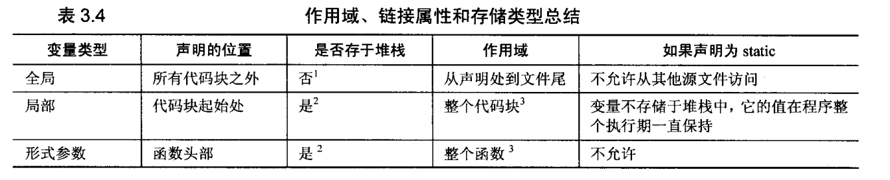

## Ch4 语句

### 4.1 空语句

```c
;
```

只包含一个分号，不执行任何任务

### 4.2 表达式语句

- C不存在赋值语句，赋值通过表达式语句(在表达式之后加上一个分号)实现，如：

  ```c
  x = y + 3;
  ```

- 以下语句也是合法的，但结果被立即丢弃：

  ```c
  y + 3;
  ```

### 4.3 代码块

位于一对花括号之内的可选的声明和语句列表

### 4.4 if语句

```c
if (expression) {
    statement
}
else {
    statement
}
```

- C语言不存在布尔变量，而使用整型的0和1代替，所以expression的结果不是0就是1

### 4.5 while语句

```c
while (expression) {
    statement
}
```

- break终止所在while代码块的所有循环；continue终止所在while代码块的当前循环

### 4.6 for语句

```c
for (初始化部分; 条件部分; 调整部分){
    statement
}
```

### 4.7 do语句

```c
do {
    statement
} while (expression);
```

- 循环体至少执行一次

### 4.8 switch语句

```c
switch (expression) {
    case constant-expression-1:
        statement-1
        break;
    case constant-expression-2:
        statement-2
        break;
    ......
}
```

- switch的条件expression必须为整型值
- 每个case标签必须具有唯一的值
- 每个switch语句都应该添加一条并且只能添加一条default语句，可以在case语句列表的任何位置

### 4.9 goto语句

```c
goto 语句标签;
```

- 语句标签是在标识符后添加一个冒号，并跟上一些表达式语句
- 要尽可能避免使用goto语句

## Ch5 操作符和表达式

### 5.1 操作符

#### 5.1.1 算术操作符

```c
+ - * / %
```

#### 5.1.2 移位操作符

- 左移：<<
- 右移：>>

- 无符号数的所有移位操作都是逻辑移位，有符号数是逻辑移位还是算术移位取决于编译器

#### 5.1.3 位操作符

```c
& | ~
// 与或非
```

- 将value指定位置1

  ```c
  value = value | 1 << bit_number;
  ```

- 将value指定位置0

  ```c
  value = value & ~ (1 << bit_number);
  ```

#### 5.1.5 单目操作符

- !：逻辑取反，产生整型结果0或1

- ~：操作数每一位取反

- -：取负

- &：取操作数的地址

- *：间接访问，访问指针所指向的值

- sizeof：判断操作数的类型长度，以字节为单位，操作数可以是变量，也可以是加上括号的类型

  - sizeof (a = b + 1)并没有向a赋值

- 强制类型转换，如获得整型变量a对应的浮点数值

  ```c
  (float) a
  ```

- c+：增值操作符，++a在变量被使用之前增加它的值，a++在变量被使用之后增加它的值

#### 5.1.6 关系操作符

```c
>  >=    <  <=    ==  !=
```

- 产生的结果是整型的0或1

#### 5.1.7 逻辑操作符

- &&：对于expression1 && expression2，若expression1为假，则不再对expression2求值
- ||：对于expression1 || expression2，若expression1为真，则不再对expression2求值

#### 5.1.8 条件操作符

expression1 ? expression2 : expression3

### 5.2 布尔值

- C没有显式的布尔类型，用整数代替，0是假，任何非零值都是真

### 5.4 表达式求值

- 函数进行表达式求值时应该尽量避免以下形式：

  ```c
  f() + g() + h()
  ```

  而使用以下形式，因为如果函数的返回值和执行顺序相关，则会产生不确定性

  ```c
  temp = f();
  temp += g();
  temp += h();
  ```

## Ch6 指针

### 6.1 内存和地址

- 内存中的每个位置由一个独一无二的地址标识
- 内存中的每个位置都包含一个值
- 编译器帮助实现通过变量访问内存位置，但是硬件仍然通过地址访问内存位置

### 6.2 值和类型

不能简单地通过检查一个值的位来判断它的类型，因为不同的数据类型和指令会将其解释为不同的类型

### 6.5 未初始化和非法的指针

在对指针进行间接访问之前，一定要进行初始化，下面是一个**错误例子**，因为指针a指向的位置不能确定：

```c
int *a;
*a = 12;
```

### 6.6 NULL指针

- NULL指针不指向任何东西

- 要使一个指针变量为NULL，可以给它赋一个零值；测试一个指针变量是否为NULL，可以将它与零值比较

### 6.7 指针、间接访问和左值

```c
int a;
int *d = &a;

// 合法，对指针d指向的值(a)进行修改
*d = 10 - *d;

// 非法，整型数的计算结果赋给指针
d = 10 - *d;
```

### 6.10 指针的指针

```c
int a = 12;
int *b = &a;
int **c = &b;
```

| 表达式 | 相当的表达式 |
| ------ | ------------ |
| a      | 12           |
| b      | &a           |
| *b     | a, 12        |
| c      | &b           |
| *c     | b, &a        |
| **c    | *b, a, 12    |

### 6.11 指针表达式

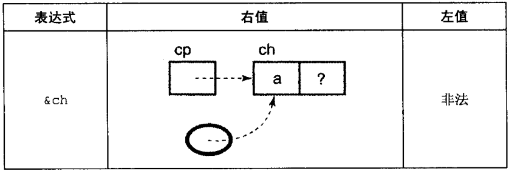

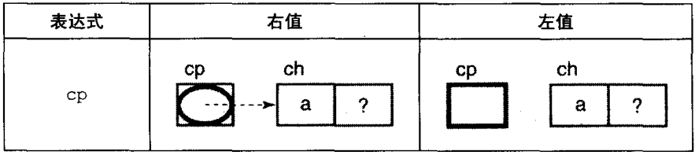

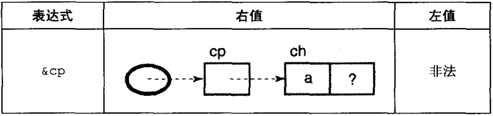

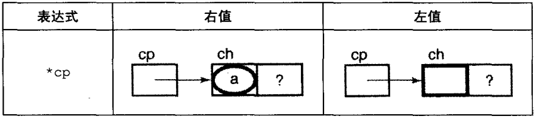

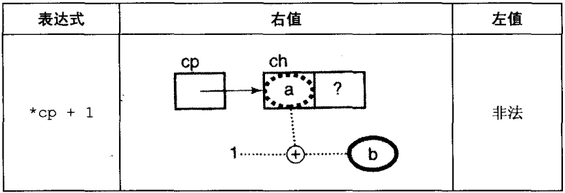

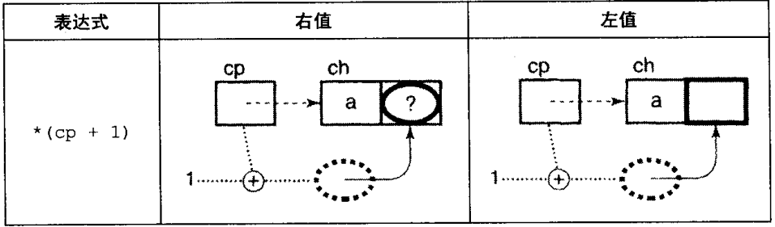

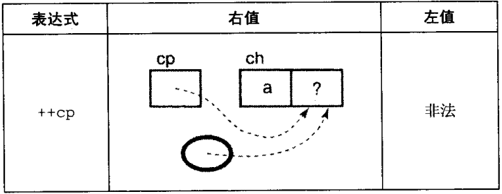

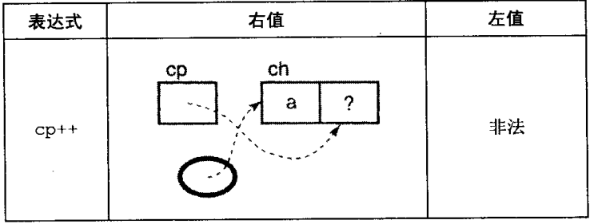

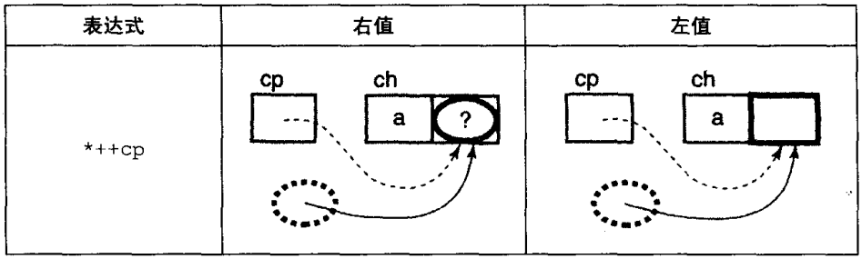

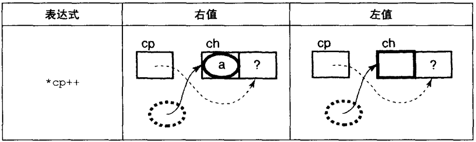

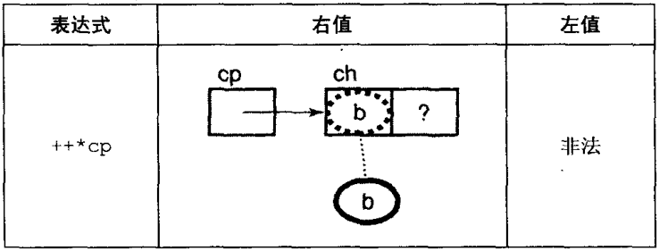

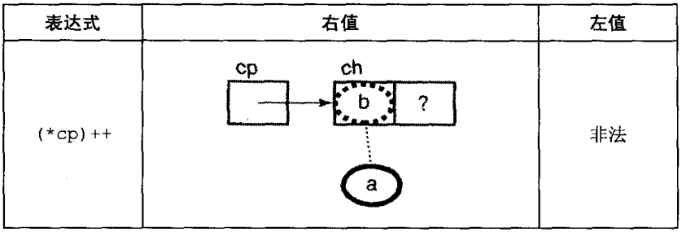

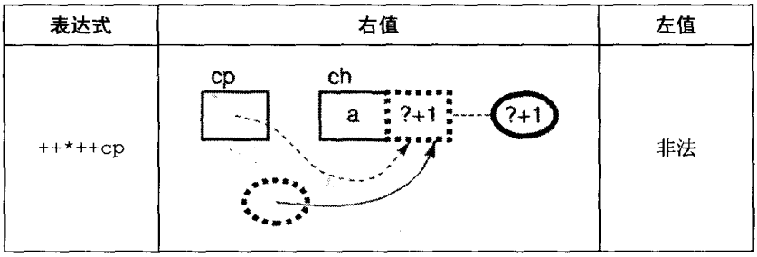

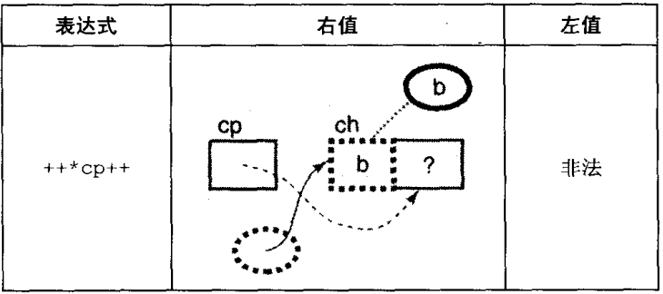

### 6.13 指针运算

#### 6.13.1 算术运算

- 当一个指针和一个整数量执行算术运算时，整数在执行加法运算前始终会根据对应变量的类型的长度进行调整。例如若float类型指针变量p占4个字节，则p+1不会指向p的第二字节，而是会指向p所占的4个字节之后的那个字节
- 两个指针只有当都指向同一个数组中的元素时，才允许进行相减，并且减法的结果是两个元素在数组中的距离，而不是内存地址的差值，即在减法运算的同时会除掉变量类型的长度

#### 6.13.2 关系运算

对于指向同一个数组中的元素的指针，可以用关系操作符(`> < >= <=`)来判断哪个指针指向数组中更前或更后的元素

## Ch7 函数

### 7.2 函数声明

#### 7.2.1 原型

- 原型总结了函数定义的起始部分的声明，向编译器提供有关函数应该如何调用的完整信息

- 函数原型的使用：

  ```c
  // func_use.c
  #include "func.h"
  ...
      
  // func.h
  int *func(int *value, int len);
  ...
  ```

- 声明一个没有参数的函数原型：

  ```c
  int *func(void);
  ```

#### 7.2.2 函数的缺省认定

当程序调用一个无法见到原型的函数时，编译器会认为该函数返回一个整型

### 7.3 函数的参数

- 所有参数都是**传值调用**，函数不会修改实际传递的参数
- 当传递的参数是指针时，可以通过指针的间接访问修改指针所指的值，称为**传址调用**

### 7.4 ADT和黑盒

使用static关键字限制对非接口函数和数据的访问

### 7.5 递归

- 通过运行时堆栈支持递归函数的实现

通过一个简单的递归作为实例：

```c
// 接受一个整型值(无符号)，把它转换为字符并打印，前导零被删除
#include <stdio.h>

void binary_to_ascii(unsigned int value) {
    unsigned int quotient;
    
    quotient = value / 10;
    if (quotient != 0) {
        binary_to_ascii(quotient);
    }
    putchar(value % 10 + '0');
}
```

#### 7.5.1 追踪递归函数

程序运行时堆栈的变化：

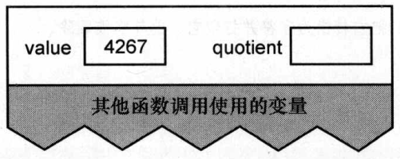

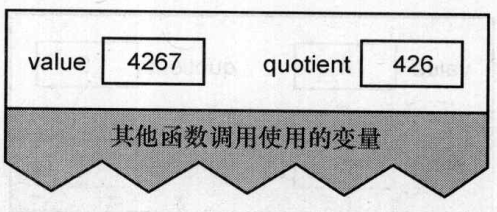

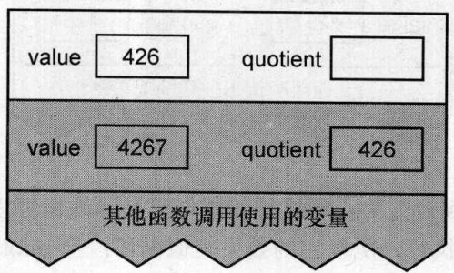

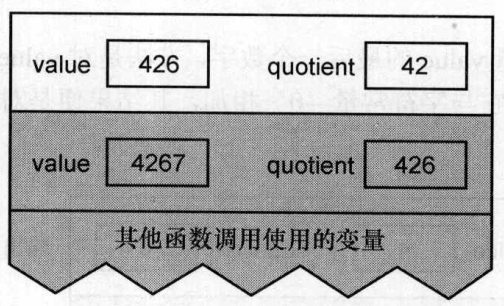

​															......

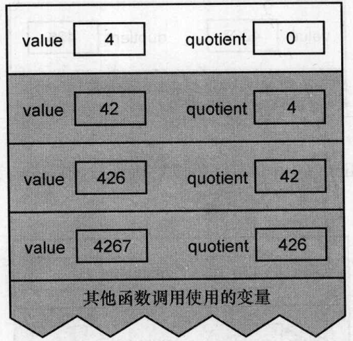

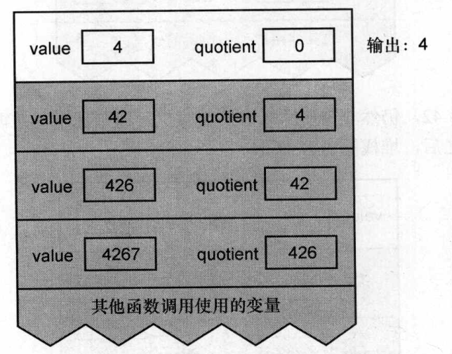

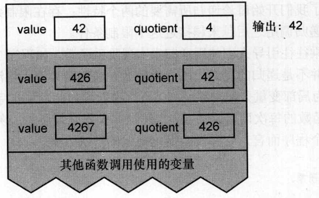

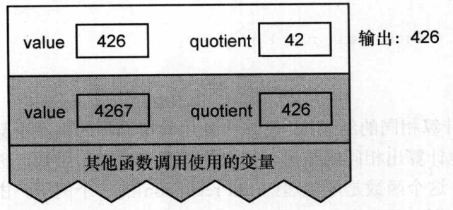

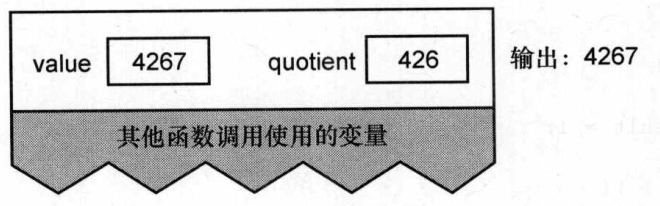

#### 7.5.2 递归与迭代

- 如果一个递归函数内部所执行的最后一条语句就是调用自身时，被称为尾部递归，这样的递归很容易被改写为循环迭代的形式，而迭代的效率通常较高

### 7.6 可变参数列表

#### 7.6.1 stdarg宏

定义于stdarg.h头文件

- 类型va_list：用于声明变量来访问参数列表的未确定部分
  - 此时声明函数的方式为`float average(int n, ...)`
- 宏va_start：初始化va_list声明的变量，第1个参数是va_list变量名，第2个参数是省略号前的最后一个有名字的参数
- 宏va_arg：用于访问参数，第1个参数是va_list变量名，第2个参数是参数列表中下一个参数的类型，返回这个参数的值，并指向下一个可变参数
- 宏va_end：访问完最后一个可变参数后调用，参数为va_list变量名

#### 7.6.2 可变参数的限制

- 这些宏无法判断实际存在的参数的数量
- 这些宏无法判断每个参数的类型

## Ch8 数组

### 8.1 一维数组

#### 8.1.1 数组名

```c
int b[10];
```

- b[3]的类型是整型

- b是一个指向b[0]的常量指针，因而不能修改数组名的值，即不能修改数组存储的内存地址

- 数组的赋值

  ```c
  int a[10];
  int b[10];
  int *c;
  
  // 以下两个表达式作用相同，将c指向a[0]
  c = &a[0];
  c = a;
  
  ```

// 以下表达式非法，不能将数组复制给数组，数组间的复制只能通过循环逐个元素复制
  b = a;

  // 以下表达式非法，a是常量，不能被修改
  a = c;
  ```
  

#### 8.1.2 下标引用

通过以下例子说明：

​```c
int array[10];
int *ap = array + 2;
  ```

| 表达式  | 对等表达式           |
| ------- | -------------------- |
| ap      | array+2, &array[2]   |
| *ap     | array[2], *(array+2) |
| ap[0]   | array[2]             |
| ap+6    | array+8, &array[8]   |
| *ap+6   | array[2]+6           |
| *(ap+6) | array[8]             |
| ap[-1]  | array[1]             |
| ap[9]   | 非法                 |

#### 8.1.3 指针与下标

指针有时比下标更加高效

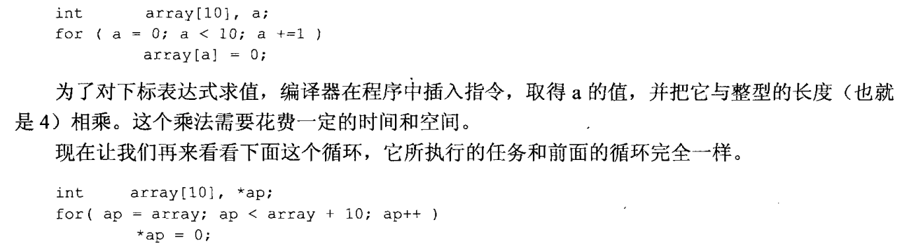

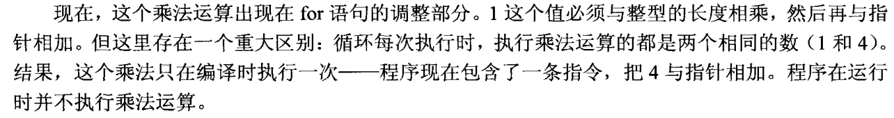

- 在数组中一次一步移动时，与固定数字相乘的运算在编译的时候完成，所以在运行时所需的指令就少
- 但这在实际中不常用，因为可能编译器对循环会有优化

#### 8.1.5 数组和指针

```c
int a[5];   // 数组
int *b;     // 指针
```

- a和b都具有指针值，都可以进行间接访问和下标引用操作

- 区别：

  - 声明数组时，编译器会为数组保留内存空间，然后再创建数组名
  - 声明指针变量时，编译器只为指针本身保留内存空间，而不为整型值分配内存空间

  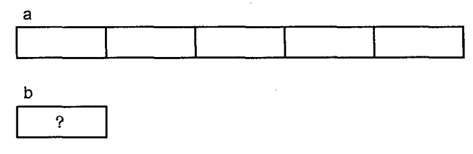

- 在上述声明后：
  - \*a是合法的，\*b是非法的，因为\*b将访问内存中某个不确定的位置
  - b++是合法的，a++是非法的，因为a是常量指针

#### 8.1.7 声明数组参数

下面的函数原型是等价的：

```c
int strlen(char *string);
int strlen(char string[]);
```

#### 8.1.8 初始化

```c
int vector[5] = {1, 2, 3, 4, 5};
```

- 静态初始化：静态变量存储在静态内存，只初始化一次
- 自动初始化：自动变量在缺省情况下是未初始化的，若给定初值，则每次进入代码块都会重新初始化

#### 8.1.9 不完整的初始化

```c
int vector[5] = {1, 2, 3, 4};
```

vector[4]被初始化为0

#### 8.1.10 自动计算数组长度

如果声明中未给出数组的长度，编译器就把数组的长度设置为刚好能够容纳所有初始值的长度

#### 8.1.11 字符数组的初始化

```c
// 初始化一个字符串数组
char message1[] = "Hello";

// 初始化一个字符串常量
char *message2 = "Hello";
```

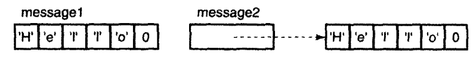

### 8.2 多维数组

#### 8.2.1 存储顺序

定义一个数组：

```c
int array[3][6];
```

其在内存中的存储形式为：

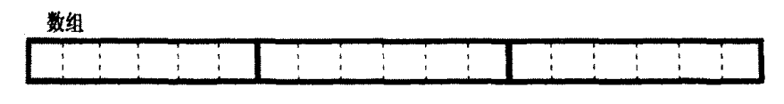

这18个元素的下标值依次是(0,0) (0,1) (0,2) (0,3) (0,4) (0,5) (1,0) ... (2,4) (2,5)

#### 8.2.2 数组名

如在`int matrix[3][10]`中，matrix是指向一个包含10个整型元素的数组的指针

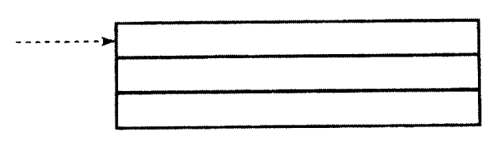

那么matrix+1则指向：

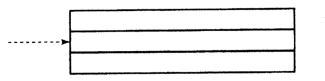

而*(matrix + 1) + 5就等价于matrix[1] + 5，是一个指向整型的指针：

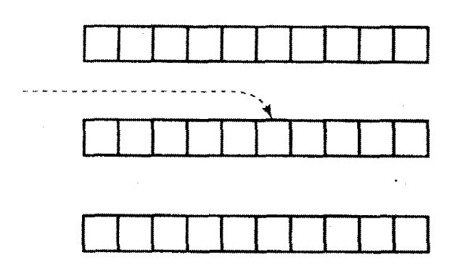

#### 8.2.4 指向数组的指针

声明一个指向整型数组的指针，并令其指向matrix数组的第一行：

```c
int (*p)[10] = matrix;
```

#### 8.2.5 作为函数参数的多维数组

可以使用以下两张形式的任何一种：

```c
void func(int (*mat)[10]);
void func(int mat[][10]);
```

#### 8.2.6 初始化

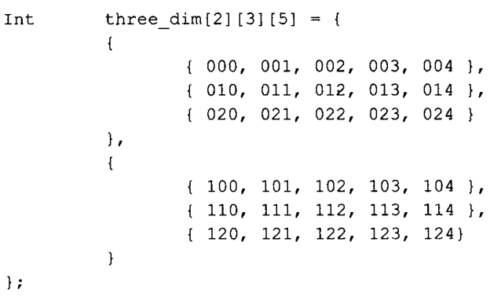

#### 8.2.7 数组长度自动计算

在多维数组中，只有第1维才能根据初始化列表缺省地提供，剩余的几个维必须显式写出

### 8.3 指针数组

定义方式如下：

```c
char const *keyword[] = {
    "do",
    "for",
    "if",
    "return",
    NULL
}
```

这样定义的好处在于如果要遍历这个表，只需要`for (kwp=keyword; *kwp!=NULL; kwp++)`

## Ch9 字符串、字符和字节

### 9.1 字符串基础

- 字符串的长度不包含最后的NUL字节
- 头文件string.h包含了使用字符串函数所需的原型和声明

### 9.2 字符串长度

```c
size_t strlen(char const *string);
```

- 返回类型为size_t，是一个无符号整数类型

- 不要在表达式中同时包含有符号数和无符号数，因此应该把strlen的返回值**强制转换为int**

### 9.3 不受限制的字符串函数

#### 9.3.1 复制字符串

```c
char *strcpy(char *dst, char const *src);
```

- dst必须是一个字符数组或是一个指向动态分配内存的数组的指针
- 复制字符串前必须保证目标字符数组的空间足以容纳需要复制的字符串，不然会覆盖数组之后内存的内容

#### 9.3.2 连接字符串

```c
char *strcat(char *dst, char const *src);
```

- 将src字符串的拷贝添加到dst字符串之后

#### 9.3.4 字符串比较

```c
int strcmp(char const *s1, char const *s2);
```

- 若s1小于s2，返回一个小于0的值；若s1大于s2，返回一个大于0的值；若s1和s2相等，返回0

### 9.4 长度受限的字符串函数

- 字符串复制，将src的前len个字符(不够补NUL)复制给dst，但当src的长度大于len时，只能复制len个字符给dst，因此结果的dst最后是没有NUL的

  ```c
  char *strncpy(char *dst, char const *src, size_t len);
  ```

- 字符串连接，将src的前len个字符(不够补NUL)连接到dst后面，会自动添加一个NUL在dst的最后

  ```c
  char *strncat(char *dst, char const *src, size_t len);
  ```

- 字符串比较，比较两个字符串的前len位

  ```c
  int strncmp(char const *s1, char const *s2, size_t len);
  ```

### 9.5 字符串查找基础

#### 9.5.1 查找一个字符

```c
char *strchr(char const *str, int ch);
char *strrchr(char const *str, int ch);
```

- 在字符串str中查找字符ch第一次出现的位置，返回一个指向该位置的指针，若没有找到返回NULL指针
- strchr从左开始找，strrchr从右开始找

#### 9.5.2 查找任何几个字符

```c
char *strpbrk(char const *str, char const *group);
```

- 返回一个指向str中第一个匹配group中任何一个字符的位置指针

#### 9.5.3 查找一个子串

```c
char *strstr(char const *s1, char const *s2);
```

- 在s1中查找整个s2第一次出现的起始位置，并返回一个指向该位置的指针

### 9.6 高级字符串查找

#### 9.6.1 查找一个字符串前缀

```c
size_t strspn(char const *str, char const *group);
size_t strcspn(char const *str, char const *group);
```

- strspn返回str起始部分匹配group中任意字符的字符数，而strcspn找的是非group中的字符

- 例如得到指向字符串中第一个非空白字符：

  ```c
  prt = buffer + strspn(buffer, "\n\t\r\f\v");
  ```

#### 9.6.2 查找标记

```c
char *strtok(char *str, char const *sep);
```

- 从字符串中隔离各个单独的称为标记的部分
- sep定义了用作分隔符的字符集合

- 若strtok的第一个参数不是NULL，函数将找到字符串的第一个标记，同时保存它在字符串中的位置；若strtok的第一个参数是NULL，函数将在同一个字符串中从保存的位置开始查找下一个标记；若找不到下一个标记，则返回NULL

- 例子：查找被空白分隔的单词

  ```c
  for (token=strtok(line, whitespace); token!=NULL; token=strtok(NULL, whitespace)) {
  	printf("%s\n", token);
  }
  ```

### 9.7 错误信息

```c
char *strerror(int error_number);
```

- 参数为错误代码，返回一个指向用于描述错误的字符串的指针

### 9.8 字符操作

头文件ctype.h

#### 9.8.1 字符分类

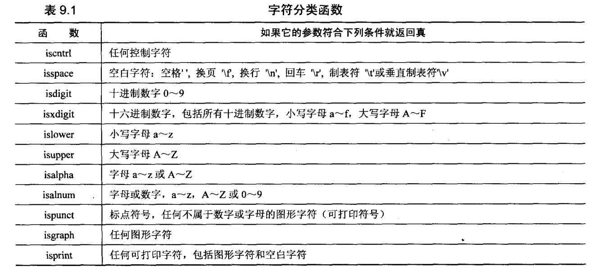

#### 9.8.2 字符大小写转换

```c
int tolower(int ch);
int toupper(int ch);
```

### 9.9 内存操作

```c
void *memcpy(void *dst, void const *src, size_t length);
void *memmove(void *dst, void const *src, size_t length);
void *memcmp(void const *a, void const *b, size_t length);
void *memchr(void const *a, int ch, size_t length);
void *memset(void *a, int ch, size_t length);
```

- 与strn带头的函数不同，这些函数遇到NUL字节时不会停止操作

## Ch10 结构和联合

### 10.1 结构基础知识

当一个结构变量在表达式中使用时，并不被替换成一个指针，而是一个标量类型

#### 10.1.1 结构声明

```c
struct {
    int a;
    char b;
    float c;
} x, y[20], *z;
```

- 声明了结构体x，包含20个结构体的数组y，指向结构体的指针z

```c
struct SIMPLE {
    int a;
    char b;
    float c;
};

struct SIMPLE x, y[20], *z;
```

推荐使用以下声明方法：

```c
typedef struct {
    int a;
    char b;
    float c;
} Simple;

Simple x, y[20], *z;
```

#### 10.1.2 结构成员

- 直接访问：

  ```c
  Simple simp;
  
  // 访问成员a
  simp.a
  ```

- 间接访问：

  ```c
  Simple *simp;
  
  // 访问成员a
  simp->a
  ```

#### 10.1.5 结构的自引用

```c
// 错误
struct SELF_REF {
    int a;
    struct SELF_REF b;
    int c;
};

// 正确
struct SELF_REF {
    int a;
    struct SELF_REF *b;
    int c;
};

// 错误
typedef struct {
    int a;
    struct SELF_REF *b;
    int c;
} SELF_REF;

// 正确
typedef struct SELF_REF_TAG {
    int a;
    struct SELF_REF_TAG *b;
    int c;
} SELF_REF;
```

#### 10.1.6 不完整的声明

用于多个相互依赖的结构体之间的声明

```c
struct B;

struct A {
    struct B *partner;
};

struct B {
    struct A *partner;
};
```

### 10.2 结构、指针和成员

后面几节都以以下结构体为例：

```c
typedef struct {
    int a;
    short b[2];
} Ex2;

typedef struct Ex {
    int a;
    char b[3];
    Ex2 c;
    struct EX *d;
};
```

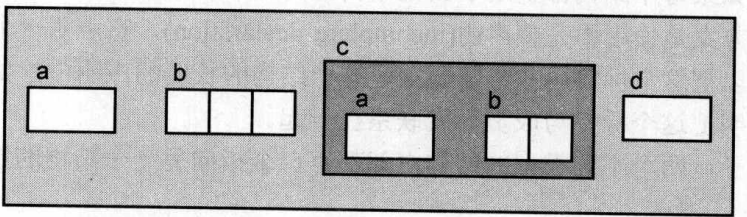

若声明一个结构体：

```c
Ex x = {10, "Hi", {5, {-1, 25}}, 0};
Ex *px = &x;
```

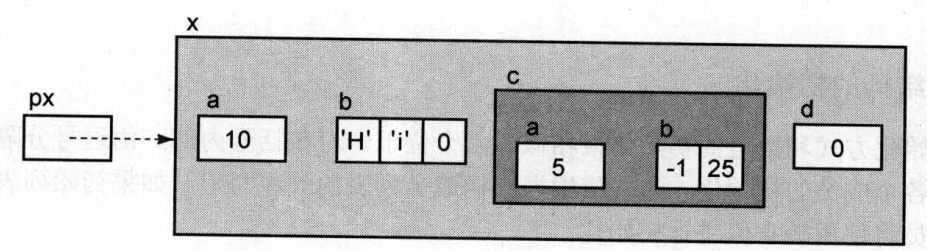

#### 10.2.1 访问指针

- px的右值：

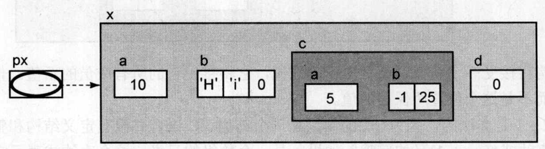

- px的左值：
  - px+1是一个非法的左值

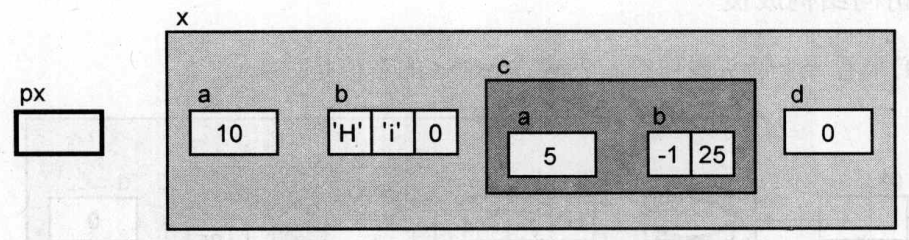

#### 10.2.2 访问结构

- *px的右值：

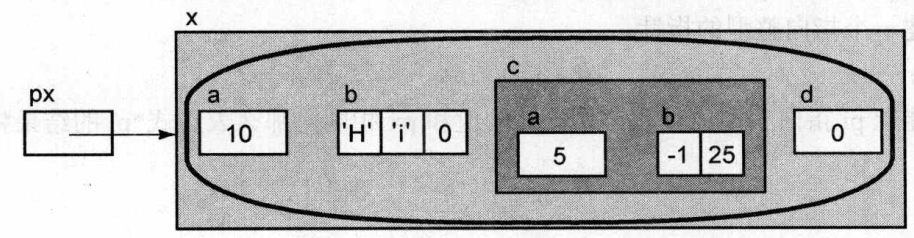

- *px的左值（接受一个新值）：
  - *px+1是非法的，因为没办法将结构体和整型相加
  - *(px+1)也是非法的

#### 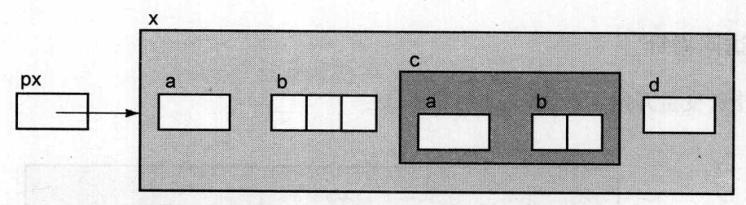10.2.3 访问结构成员

- px->a的右值：

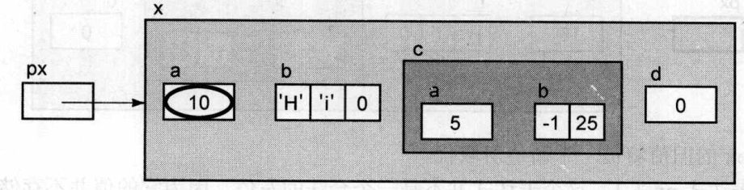

- 如果进行以下声明：

  ```c
  int *pi;
  pi = &px->a;
  ```

  则pi为：

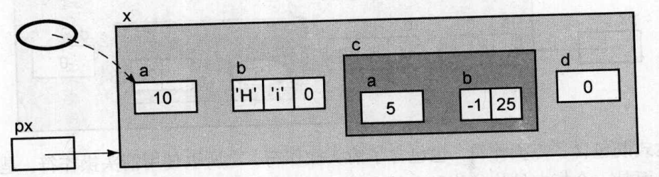

​	**注：***px的结果是整个结构，而*pi的结果是一个整型数

- px->b的右值为指针常量，所以没有合法左值：
  - 对数组元素的访问采用px->b[1]

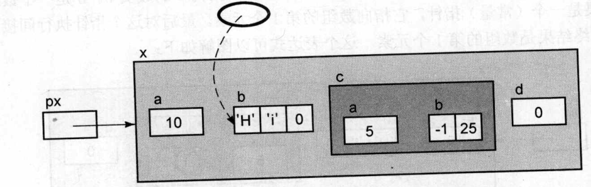

#### 10.2.4 访问嵌套的结构

- px->c的左值是整个结构，右值如下：

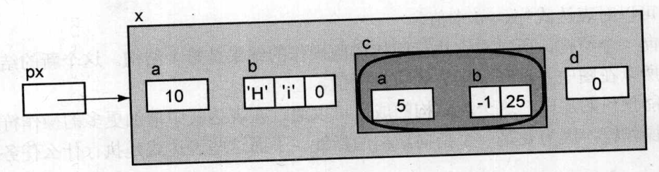

- px->c.a的右值：

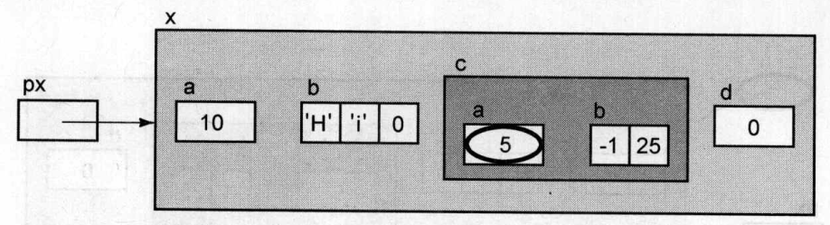

- *px->c.b的右值：

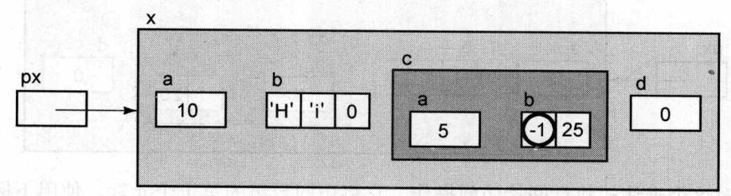

#### 10.2.5 访问指针成员

对px->d进行初始化，使其指向一个结构体：

```c
Ex y;
px->d = &y;
```

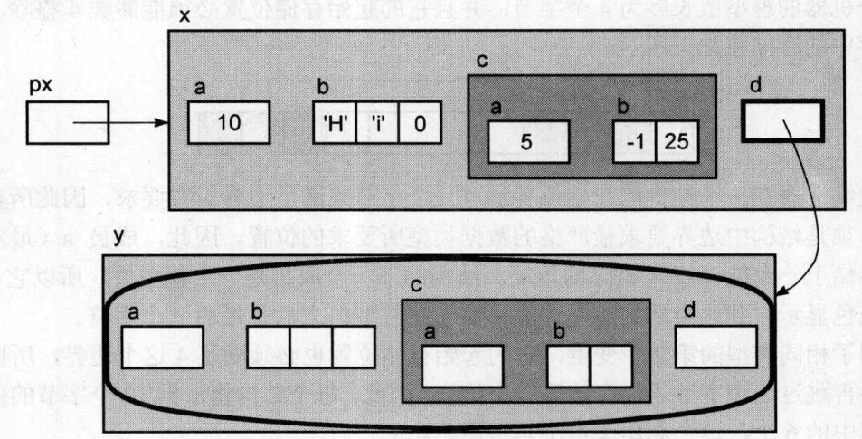

- px->d->c.b[1]的右值：

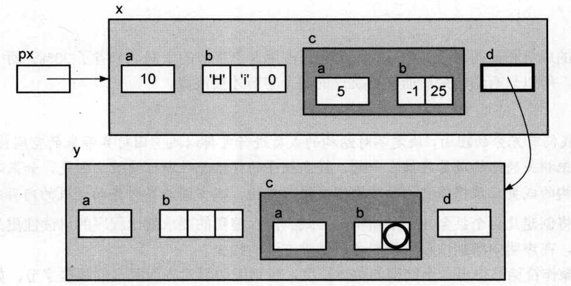

### 10.3 结构的存储分配

```c
struct ALIGN {
    char a;
    int b;
    char c;
};
```

对于上述结构体，若整型长度为4字节，而且它的起始存储位置必须能被4整除，于是a存储为1字节，但是后面必须空出3字节才能存放b，其存储形式为：

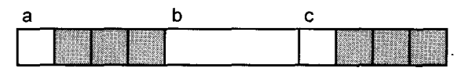

一个结构体占了12个字节的存储空间，有效利用空间却只有6字节

如果声明改为如下形式，则只需要8个字节就能存储这个结构体：

```c
struct ALIGN {
    int b;
    char a;
    char c;
};
```

- sizeof可以得出一个结构体的整体长度，包括跳过的字节
- 使用offset(type, member)能获得结构体中某成员的实际位置，如offset(struct ALIGN, b)

### 10.4 作为函数参数的结构

- 最好使用指针来传递参数，并声明为寄存器变量来提高效率

  - 若结构体成员不能改变，则：

    ```c
    void test(register ALIGN const *test);
    ```

  - 若需要根据程序运行结果修改结构体中的值，则：

    ```c
    void test(register ALIGN *test);
    ```

  - 调用方式都为：

    ```c
    test(&align);
    ```

### 10.5 位段

- 注重可移植性的程序应该避免使用位段

### 10.6 联合

- 联合的所有成员引用的是内存中的相同位置

- 如果联合的各个成员具有不同的长度，联合的长度就是最长成员的长度

- 应用场景比如：

  ````c
  struct VARIABLE {
      enum {INT, FLOAT, STRING} type;
      union {
          int i;
          float f;
          char *s;
      } value;
  };
  ````

  对于整型，type设为INT，存储于value.i中；对于浮点数，type设为FLOAT，存储于value.f中；

- 联合的初始化，初始值必须是联合第一个成员的类型，如

  ```c
  union {
      int a;
      float b;
      char c[4];
  } x = {5};
  ```

## Ch11 动态内存分配

### 11.1 为什么使用动态分配内存

声明数组时，数组的长度往往在运行时才能知道，但是编译时需要指定数组的长度，因为需要提前开辟内存空间。

### 11.2 malloc和free

- 在头文件stdlib.h中声明

#### 11.2.1 malloc

```c
void *malloc(size_t size);
```

- malloc从内存池中提取一块合适的内存，并返回一个指向这块内存起始位置的指针(如果内存池中的内存可以满足需求的话，否则返回NULL)
- 参数是需要分配的内存字节数
- malloc分配的是一块连续的内存
- 分配的内存不会被初始化

#### 11.2.2 free

```c
void free(void *pointer);
```

- 参数是NULL时不会产生任何效果
- 参数是先前从malloc、calloc或realloc返回的值时，将分配的内存归还给内存池

### 11.3 calloc和realloc

#### 11.3.1 calloc

```c
void *calloc(size_t num_elements, size_t element_size);
```

- 参数包括所需元素的数量和每个元素的字节数
- 将分配的内存初始化为0

#### 11.3.2 realloc

```c
void *realloc(void *ptr, size_t new_size);
```

- 用于修改一个原先已经分配的内存块的大小
- 扩大内存块时，在原先的内存块之后添加；缩小内存块时，从原先内存块的尾部删除

### 11.4 使用动态分配的内存

- 获得足够存储25个整型的内存

  ```c
  int *pi;
  pi = malloc(25 * sizeof(int));
  ```

### 11.5 常见的动态内存错误

- 对NULL指针进行解引用操作
- 对分配的内存进行操作时越界
- 释放并非动态分配的内存
- 试图释放一块动态分配的内存的一部分
- 一块动态内存被释放之后被继续使用

- 内存泄漏：在使用完毕动态内存后没有进行释放

## Ch12 使用结构和指针

### 12.2 单链表

声明一个节点：

```c
typedef struct NODE {
    struct NODE *link;
    int value;
} Node;
```

链表结构如图所示：

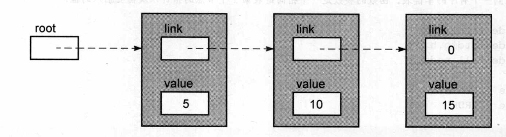

#### 12.2.1 插入一个有序单链表

```c
// 函数的参数是一个指向链表第一个节点的指针，以及一个需要插入的新值
#include <stdio.h>
#include <stdlib.h>
#include "sll_node.h"

#define FALSE 0
#define TRUE 1

int sll_insert(register Node **linkp, int new_value) {
    register Node *current;
    register Node *new;
    
    // 寻找正确的插入位置
    while ((current=*linkp) != NULL && current->value < new_value) {
        linkp = &current->link;
    }
    
    // 为新节点分配内存
    new = (Node *)malloc(sizeof(Node));
    if (new == NULL) {
        return FALSE;
    }
    new->value = new_value;
    
    // 插入节点
    new->link = current;
    *linkp = new;
    return TRUE;
}
```

### 12.3 双链表

声明一个双链表节点:

```c
typedef struct NODE {
    struct NODE *fwd;
    struct NODE *bwd;
    int value;
} Node;
```

双链表结构如图所示：

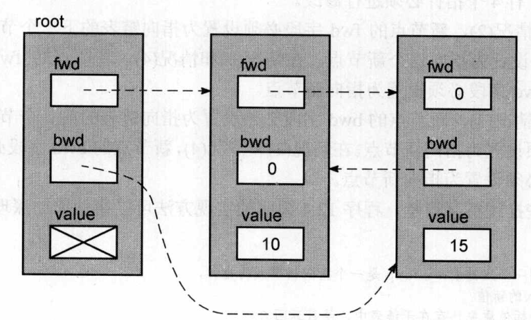

